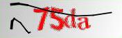
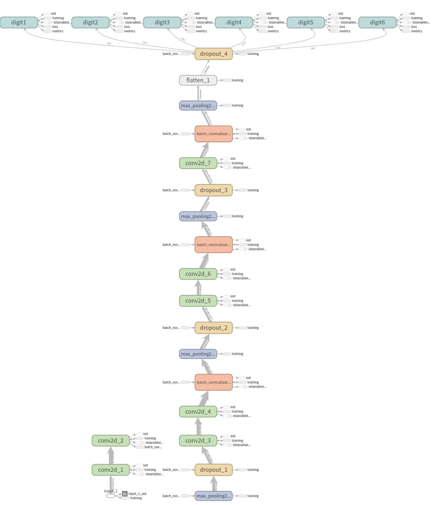

# urp_captcha_solver

用Keras对URP教务验证码的识别训练 

python3环境



# 使用
```shell
pip install -r requirements.txt
python3 model_test.py
```

# 说明

模型及训练集均来源于网上，请勿用于非法用途

# 训练集

来源于网上，具体链接忘记了。大约8W张标记好的训练集,如需要，可以ISSUE里留言

有一种可行的方案是观察验证码的特征，模拟生成。本人水平有限，就不尝试了。

参考项目[https://github.com/JasonLiTW/simple-railway-captcha-solver](https://github.com/JasonLiTW/simple-railway-captcha-solver)

# 模型

参考[https://github.com/JasonLiTW/simple-railway-captcha-solver](https://github.com/JasonLiTW/simple-railway-captcha-solver)
(参考项目是6字符的)

model.summary()
```
__________________________________________________________________________________________________
Layer (type)                    Output Shape         Param #     Connected to                     
==================================================================================================
input_1 (InputLayer)            (None, 56, 176, 3)   0                                            
__________________________________________________________________________________________________
conv2d_1 (Conv2D)               (None, 56, 176, 32)  896         input_1[0][0]                    
__________________________________________________________________________________________________
conv2d_2 (Conv2D)               (None, 54, 174, 32)  9248        conv2d_1[0][0]                   
__________________________________________________________________________________________________
batch_normalization_1 (BatchNor (None, 54, 174, 32)  128         conv2d_2[0][0]                   
__________________________________________________________________________________________________
max_pooling2d_1 (MaxPooling2D)  (None, 27, 87, 32)   0           batch_normalization_1[0][0]      
__________________________________________________________________________________________________
dropout_1 (Dropout)             (None, 27, 87, 32)   0           max_pooling2d_1[0][0]            
__________________________________________________________________________________________________
conv2d_3 (Conv2D)               (None, 27, 87, 64)   18496       dropout_1[0][0]                  
__________________________________________________________________________________________________
conv2d_4 (Conv2D)               (None, 25, 85, 64)   36928       conv2d_3[0][0]                   
__________________________________________________________________________________________________
batch_normalization_2 (BatchNor (None, 25, 85, 64)   256         conv2d_4[0][0]                   
__________________________________________________________________________________________________
max_pooling2d_2 (MaxPooling2D)  (None, 12, 42, 64)   0           batch_normalization_2[0][0]      
__________________________________________________________________________________________________
dropout_2 (Dropout)             (None, 12, 42, 64)   0           max_pooling2d_2[0][0]            
__________________________________________________________________________________________________
conv2d_5 (Conv2D)               (None, 12, 42, 128)  73856       dropout_2[0][0]                  
__________________________________________________________________________________________________
conv2d_6 (Conv2D)               (None, 10, 40, 128)  147584      conv2d_5[0][0]                   
__________________________________________________________________________________________________
batch_normalization_3 (BatchNor (None, 10, 40, 128)  512         conv2d_6[0][0]                   
__________________________________________________________________________________________________
max_pooling2d_3 (MaxPooling2D)  (None, 5, 20, 128)   0           batch_normalization_3[0][0]      
__________________________________________________________________________________________________
dropout_3 (Dropout)             (None, 5, 20, 128)   0           max_pooling2d_3[0][0]            
__________________________________________________________________________________________________
conv2d_7 (Conv2D)               (None, 3, 18, 256)   295168      dropout_3[0][0]                  
__________________________________________________________________________________________________
batch_normalization_4 (BatchNor (None, 3, 18, 256)   1024        conv2d_7[0][0]                   
__________________________________________________________________________________________________
max_pooling2d_4 (MaxPooling2D)  (None, 1, 9, 256)    0           batch_normalization_4[0][0]      
__________________________________________________________________________________________________
flatten_1 (Flatten)             (None, 2304)         0           max_pooling2d_4[0][0]            
__________________________________________________________________________________________________
dropout_4 (Dropout)             (None, 2304)         0           flatten_1[0][0]                  
__________________________________________________________________________________________________
dense_1 (Dense)                 (None, 36)           82980       dropout_4[0][0]                  
__________________________________________________________________________________________________
dense_2 (Dense)                 (None, 36)           82980       dropout_4[0][0]                  
__________________________________________________________________________________________________
dense_3 (Dense)                 (None, 36)           82980       dropout_4[0][0]                  
__________________________________________________________________________________________________
dense_4 (Dense)                 (None, 36)           82980       dropout_4[0][0]                  
==================================================================================================
Total params: 916,016
Trainable params: 915,056
Non-trainable params: 960
```

(这里是照搬的图，实际用的时候是4字符的)



